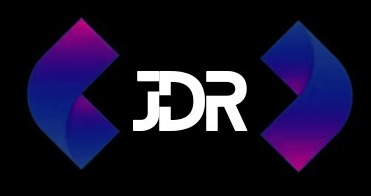

<h2 align="left">Hi 👋! My name is Jose David</h2>

  
    
  

  <h3 align="left">🛠 Language and tools</h3>
   
  
  
  
  
  
  
  
  
  
  
  
  
  
  
  
  
  
  
  
  
  
  
  
  
  
  
  
  
  
  
  
  
  
  
  
  
  
  
  
  
  
  

 

<h4 align="left">
I am a software development enthusiast with a strong commitment to improve my skills and share knowledge,
passionate about technology and programming, dedicated to creating innovative solutions and constantly learning.
My journey is not just personal, but shared. I believe in the importance of sharing knowledge and experiences with other enthusiasts and learners. 🚀 </h4>
 

  
  

  

  

